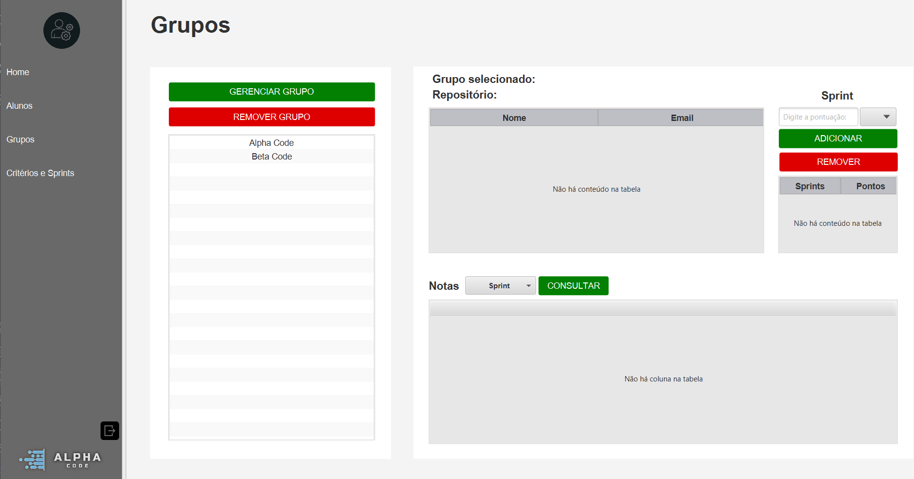
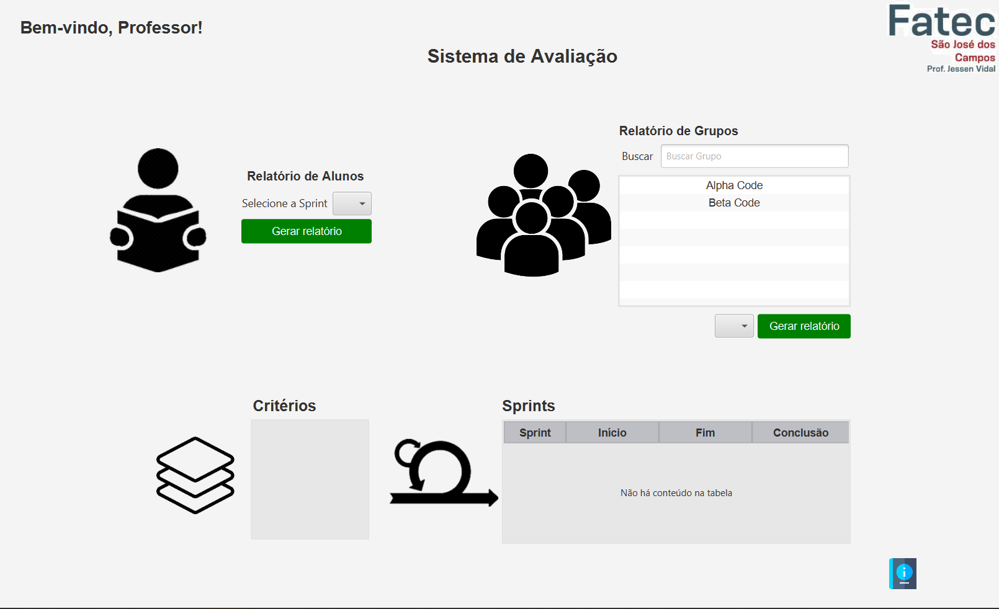

# Sistema de Avaliação

<i>Projeto desenvolvido pela da equipe Alpha Code</i>

### Índice

* [Descrição do Projeto e Funcionalidades](#descrição-do-projeto-e-funcionalidades)
* [Backlog do Produto](#backlog-do-produto)
* [Definition of Ready](#definition-of-ready)
* [Wireframe do projeto](#wireframe-do-projeto)
* [Modelo DER](#modelo-der)
* [Guia de Instalação e Manual](#guia-de-instalação-e-manual)
* [Autores do Projeto](#autores-do-projeto-equipe-alpha-code)

# Descrição do Projeto e Funcionalidades

 O presente projeto visa desenvolver um software intuitivo e seguro que empodera os alunos de uma instituição de ensino superior, proporcionando autonomia para gerenciar suas notas acadêmicas de forma personalizada. Essa ferramenta aumenta a transparência no processo avaliativo, fortalece o engajamento do aluno com seus estudos e otimiza os processos da instituição, liberando tempo para que professores e coordenadores se dediquem a atividades mais estratégicas. 

### Funcionalidades

* Permite que um aluno avalie todos os membros de sua equipe ao final de cada Sprint;

* Permitie que o professor gere um relatório contendo a nota média por aluno
  para cada critério de avaliação em uma determinada Sprint;

* Fornecer uma forma de carregar informações referentes aos grupos por meio de arquivo;

* Possibilita a edição de membros em grupos no caso de realocações;

* Permite o gerenciamento dos critérios de avaliação;

* Permite que o professor cadastre o calendário de Sprints para cada semestre;

### Metodologia de Desenvolvimento

O desenvolvimento do projeto segue a metodologia Scrum, uma metodologia ágil a fim de otimizar o tempo e garantir flexibilidade e autonomia para os membro da equipe, dividindo-o em etapas de desenvolvimento que incluem análise de requisitos, desenvolvimento da interface, implementação das funcionalidades, casos de teste e integração de todas as partes. No decorrer da elaboração do produto serão utilizadas boas práticas de programação, documentação detalhada e revisões regulares para garantir a qualidade e robustez do software, além de reuniões para identificar as necessidades e prioridades da equipe, como um todo.

### Tecnologias utilizadas

* <b>Linguagem de programação:</b> A linguagem de programação utilizada para o desenvolvimento do produto será Java, e o
  acesso ao banco de dados será feito com SQL. Para a visualização e criação da interface gráfica será utilizado o
  JavaFX Scene Builder;
* <b>IDE:</b> A IDE utilizada pela equipe será o IntelliJ IDEA;
* <b>SGBD:</b> O sistema gerenciador de banco de dados utilizado será o PostgreSQL;
* <b>Wireframe:</b> Para o desenho do wireframe do projeto, será utilizado o Figma;
* <b>Gerenciamento da equipe e do projeto:</b> Para o gerenciamento da equipe, serão utilizados o Jira, o Miro e o
  Github.

  

# Backlog do produto

| RANK | PRIORIDADE |                                                                                    USER STORIES                                                                                     | ESTIMATIVA | SPRINT | REQUISITO DO PARCEIRO |
|:----:|:----------:|:-----------------------------------------------------------------------------------------------------------------------------------------------------------------------------------:|:----------:|:------:|:---------------------:|
|  1   |   MÉDIA    | Como professor, eu quero definir quais alunos irão participar dos processos de avaliação de forma simples e intuitiva, para que posteriormente eu possa formar grupos de avaliação. |  15 Dias   |   1    |           1           |
|  2   |   MÉDIA    |              Como professor, eu quero informar os alunos e grupos que vão se avaliar de forma fácil e rápida, a fim de otimizar o meu tempo e evitar possíveis erros.               |  15 Dias   |   2    |           2           |
|  3   |    ALTA    |              Como professor, eu quero que os alunos possam se autoavaliar e avaliar o grupo, para que eu não precise digitar as notas, afim de evitar possíveis erros.              |  15 Dias   |   3    |           3           |
|  4   |   MÉDIA    |      Como professor, eu quero definir os critérios de avaliação que irão compor as notas dos grupos, para que sejam consideradas competências relevantes para fins acadêmicos.      |  21 Dias   |   3    |           4           |
|  5   |    ALTA    |                          Como professor, eu quero definir o início e o fim das Sprints, para que os alunos tenham prazos para participarem das avaliações.                          |  21 Dias   |   3    |           5           |
|  6   |    ALTA    |                Como professor, eu desejo ver as notas e médias dos alunos e grupos avaliados, para que eu possa acompanhar os resultados de forma simples e rápida.                 |  21 Dias   |   4    |           6           |

 

## **Definition of Ready**

O Definition of Ready (DoR) deste projeto define o que é necessário para que uma User Story esteja pronta para ser
desenvolvida. Nos tópicos a seguir, são expostos os requisitos definidos, os critérios de aceitação e os recursos
necessários para o desenvolvimento da aplicação, como o banco de dados e as interfaces de usuário.

Interações com o Cliente

> [Perguntas realizados ao Cliente](documentacao/Cliente/interacaocomCliente.pdf)

> [Entregas](documentacao/Cliente/entregas.pdf)

  
Sprint 1: Concepção e Planejamento de Sprints

**Definition of Ready (DoR) - Sprint 1: Concepção e Planejamento de Sprints**

User Story 1 - Definição dos Alunos

|  USER STORY  |                                                                 Como professor, eu quero definir quais alunos irão participar dos processos de avaliação de forma simples e intuitiva, para que posteriormente eu possa formar grupos de avaliação.                                                                  |
|:------------:|:--------------------------------------------------------------------------------------------------------------------------------------------------------------------------------------------------------------------------------------------------------------------------------------------------------------------:|
| **OBJETIVO** | **Desenvolver um sistema que permita ao professor gerenciar a participação dos alunos nas avaliações. Isso inclui a criação de grupos de avaliação, cadastro de alunos e a implementação de uma interface amigável para facilitar a navegação.  Nesta User Story será desenvolvido os aspectos inicias do projeto.** |

* ### **Critérios de Aceitação**

_<b>TELA DE LOGIN_

1. [X] O sistema deve permitir ao professor definir facilmente quais alunos participarão do processo de avaliação.
2. [X] A interface deve ser simples e intuitiva para garantir a rápida identificação e seleção dos alunos.

_<b>DEPENDÊNCIAS_

1. [X] O banco de dados deve estar configurado para armazenar as informações dos alunos.
2. [X] A interface para gestão dos alunos deve estar preparada para exibir, selecionar e alterar o status dos alunos.

_<b>DESIGN E USABILIDADE_

1. [X] O design da tela deve ser simples, com foco na usabilidade e clareza na seleção dos alunos.

Sprint 2: Desenvolvimento do Projeto

**Definition of Ready (DoR) - Sprint 2: Desenvolvimento do Projeto**

User Story 2 - Importação dos Dados de Alunos e Grupos

| USER STORY |                              Como professor, eu quero informar os alunos e grupos que vão se avaliar de forma fácil e rápida, a fim de otimizar o meu tempo e evitar possíveis erros.                               |
|:----------:|:-------------------------------------------------------------------------------------------------------------------------------------------------------------------------------------------------------------------:|
|  OBJETIVO  | Facilitar as tarefas do professor, a importação de dados de alunos e grupos através de um arquivo CSV, garante que o processo seja intuitivo e seguro, contribuindo para uma gestão mais eficiente das informações. |

* ### **Critérios de Aceitação**

_<b>INTEGRAÇÃO COM O BANCO DE DADOS_

1. [X] O banco de dados deve estar pronto para receber os dados dos alunos e grupos.

_<b>DESIGN E USABILIDADE_

1. [X] O fluxo de importação deve ser visualmente claro, sem etapas complexas.
2. [X] Mensagens de feedback (erro ou sucesso) devem ser exibidas de forma clara e objetiva.

Sprint 3: Avaliação de Alunos

**Definition of Ready (DoR) - Avaliação de Alunos**

User Story 3 - Autoavaliação e Avaliação de Grupos

| USER STORY | Como professor, eu quero que os alunos possam se autoavaliar e avaliar o grupo, para que eu não precise digitar as notas, afim de evitar possíveis erros. |
|:----------:|:---------------------------------------------------------------------------------------------------------------------------------------------------------:|
|  OBJETIVO  |        Facilitar a autoavaliação e avaliação em grupo dos alunos, permitindo que os professores economizem tempo na digitação de notas dos alunos.        |

* ### **Critérios de Aceitação**

_<b>BANCO DE DADOS_

1. [X] O código para exibir as avaliações de forma clara para os alunos deve estar pronto.
2. [X] As tabelas de avaliação devem estar configuradas no banco de dados.

_<b>TELA HOME DO ALUNO_

1. [X] A tela de home do aluno deve permitir a autoavaliação e a avaliação dos integrantes de grupo de forma intuitiva e
   clara.
2. [X] Mensagens de erro e confirmação de sucesso devem ser implementadas corretamente.

_<b>DESIGN E USABILIDADE_

1. [X] O design da tela de avaliação deve ser simples e direto, com opções claras para os alunos.
2. [X] Mensagens de erro e confirmação de sucesso devem ser implementadas corretamente.

User Story 4 - Definição dos Critérios de Avaliação

| USER STORY |    Como professor, eu quero definir os critérios de avaliação que irão compor as notas dos grupos, para que sejam consideradas competências relevantes para fins acadêmicos    |
|:----------:|:------------------------------------------------------------------------------------------------------------------------------------------------------------------------------:|
|  OBJETIVO  | Permitir que o professor crie e gerencie critérios de avaliação, para que as notas reflitam habilidades e competências essenciais para o desenvolvimento acadêmico dos alunos. |

* ### **Critérios de Aceitação**

_<b>BANCO DE DADOS_

1.[X] O banco de dados deve estar configurado para armazenar os critérios de avaliação.

_<b>TELA DE CRITÉRIOS_

1.[X] O sistema deve permitir ao professor definir critérios de avaliação.
2. [X] Os critérios devem ser aplicáveis às notas dos alunos e grupos.

_<b>DESIGN E USABILIDADE_

1.[X] O processo de definição dos critérios deve ser intuitivo, sem etapas complicadas.
2. [X] A tela para a criação e gerenciamento dos critérios deve estar pronta.

User Story 5 - Definição das Sprints

| USER STORY | Como professor, eu quero definir o início e o fim das Sprints, para que os alunos tenham prazos para participarem das avaliações. |
|:----------:|:---------------------------------------------------------------------------------------------------------------------------------:|
|  OBJETIVO  |                                   Permitir que o professor controle os periodos das avaliações.                                   |

* ### **Critérios de Aceitação**

_<b>BANCO DE DADOS_

1.[X] O banco de dados deve estar configurado para armazenar as datas de início e fim das Sprints.

_<b>TELA DE SPRINTS_

1. [X] O professor deve ser capaz de definir o início e o fim das Sprints.
2. [X] O sistema deve permitir a visualização clara dessas datas.

_<b>DESIGN E USABILIDADE_

1.[X] A interface para configurar as Sprints deve ser clara, com campos visíveis para a entrada das datas e visualização
  das configurações de cada Sprint.
2.[X] A interface para a criação e visualização das Sprints deve estar implementada.

Sprint 4: Acesso aos Resultados de Avaliação

**Definition of Ready (DoR) - Acesso aos Resultados de Avaliação**

User Story 6 - Visualização das Notas e Médias

| USER STORY | Como professor, eu desejo ver as notas e médias dos alunos e grupos avaliados, para que eu possa acompanhar os resultados de forma simples e rápida, |
|:----------:|:----------------------------------------------------------------------------------------------------------------------------------------------------:|
|  OBJETIVO  |                                     Permitir que o professor visualize de forma clara as informações existentes.                                     |

* ### **Critérios de Aceitação**

_<b>BANCO DE DADOS_

1. [X] O sistema deve ter as tabelas configuradas para armazenar e exibir as notas e médias.

_<b>TELA DE RESULTADOS_

1. [X] A funcionalidade de cálculo das médias deve estar implementada corretamente.
2. [X] O professor deve ser capaz de ver as notas e médias de cada aluno e grupo.

_<b>DESIGN E USABILIDADE_

1.[X] A interface de visualização de notas deve ser limpa, com os dados organizados de forma lógica (por aluno, por
  grupo, etc.).
2. [X] A interface de visualização das notas deve ser simples, clara e fácil de entender.

# Backlog por Sprint

### Sprint 1. Concepção e Planejamento de Sprints

User Story 1 - Definição dos Alunos

|  USER STORY  |                                                                                         Como professor, eu quero criar e verificar, grupos de avaliação, para que eu possa obter as informações de forma rápida e intuitiva.                                                                                         |
|:------------:|:--------------------------------------------------------------------------------------------------------------------------------------------------------------------------------------------------------------------------------------------------------------------------------------------------------------------:|
| **OBJETIVO** | **Desenvolver um sistema que permita ao professor gerenciar a participação dos alunos nas avaliações. Isso inclui a criação de grupos de avaliação, cadastro de alunos e a implementação de uma interface amigável para facilitar a navegação.  Nesta User Story será desenvolvido os aspectos inicias do projeto.** |

### Definition of Done (DoD) - Sprint 1: Concepção e Planejamento de Sprints

_<b>BANCO DE DADOS_

1. [X] A tabela de alunos está configurada e contém as informações necessárias para a participação na avaliação.

_<b>FUNCIONALIDADE_

1.[X] O sistema permite que o professor selecione e defina quais alunos participarão do processo de avaliação.
2. [X] Mensagens de erro ou sucesso são exibidas corretamente, dependendo da interação do professor.

_<b>TELA HOME_

1. [X] A tela Home está desenvolvida com os principais atalhos de navegação e permite a navegação entre as interfaces.

_<b>LAYOUT/DESIGN_

1. [X] A interface das telas foi projetada de forma intuitiva e de fácil navegação.
2. [X] A navegação entre as interfaces foi testado e estão funcionando corretamente.

_<b>SEGURANÇA E FUNCIONALIDADE_

1. [X] O código para verificação das credenciais de login está funcionando corretamente e de forma segura.
2. [X] Todos os fluxos de navegação (login → home) foram testados e estão funcionando corretamente.

### Sprint 2. Desenvolvimento do Projeto

User Story 2 - Importação dos Dados de Alunos e Grupos

| USER STORY |                              Como professor, eu quero informar os alunos e grupos que vão se avaliar de forma fácil e rápida, a fim de otimizar o meu tempo e evitar possíveis erros.                               |
|:----------:|:-------------------------------------------------------------------------------------------------------------------------------------------------------------------------------------------------------------------:|
|  OBJETIVO  | Facilitar as tarefas do professor, a importação de dados de alunos e grupos através de um arquivo CSV, garante que o processo seja intuitivo e seguro, contribuindo para uma gestão mais eficiente das informações. |

### Definition of Done (DoD) - Sprint 2: Desenvolvimento do Projeto

_<b>INTEGRAÇÃO COM O BANCO DE DADOS_

1. [X] Os dados importados via CSV são armazenados corretamente no banco de dados

_<b>TELA DE ALUNOS_

1. [X] O professor pode fazer o upload de um arquivo CSV e os dados são importados corretamente.
2. [X] O sistema exibe uma mensagem de sucesso ou erro, dependendo do resultado da importação.
3. [X] A tela de alunos permite que o professor busque, visualize e manipule os dados se necessário.

_<b>DESIGN E USABILIDADE_

1. [X] O processo de importação de CSV foi integrado de forma intuitiva.
2. [X]  A importação de dados foi validada com diferentes cenários de dados (CSV com dados corretos, incompletos ou
3. [X]   inválidos).
4. [X] As funções de buscar, adicionar, editar e remover estão testadas e validadas.

_<b>TESTES_

1.[X] O código foi analisado, testado e revisado.
 

### Sprint 3 . Desenvolvimento do Projeto

##### **Na Sprint 3 serão desenvolvidas 3 User Stories**

User Story 3 - Autoavaliação e Avaliação de Grupos

| USER STORY | Como professor, eu quero que os alunos possam se autoavaliar e avaliar o grupo, para que eu não precise digitar as notas, afim de evitar possíveis erros. |
|:----------:|:---------------------------------------------------------------------------------------------------------------------------------------------------------:|
|  OBJETIVO  |        Facilitar a autoavaliação e avaliação em grupo dos alunos, permitindo que os professores economizem tempo na digitação de notas dos alunos.        |

### Definition of Done (DoD) - Avaliação de Alunos

_<b>BANCO DE DADOS_

1. [X] As tabelas para armazenar a autoavaliação e avaliação estão implementadas e integradas com o sistema.
2. [X] As operações SQL para inserir, atualizar e recuperar avaliações estão funcionando corretamente.

_<b>TELA HOME DO ALUNO_

1. [X] A tela de home para o aluno está funcional.
2. [X] Os alunos podem realizar autoavaliação e avaliação dos integrantes de grupo de maneira fácil e intuitiva.

_<b>USABILIDADE_

1. [X] O código foi revisado e testado para garantir a integridade e funcionalidade das avaliações.
2. [X] Mensagens de erro e confirmações de sucesso foram implementadas corretamente.
     

 
 
User Story 4 - Definição das Sprints

| USER STORY | Como professor, eu quero definir o início e o fim das Sprints, para que os alunos tenham prazos para participarem das avaliações. |
|:----------:|:---------------------------------------------------------------------------------------------------------------------------------:|
|  OBJETIVO  |                                   Permitir que o professor controle os periodos das avaliações.                                   |

### Definition of Done (DoD) - Definição de Sprints

_<b>BANCO DE DADOS_

1. [X] O banco de dados deve estar configurado para armazenar as datas de início e fim de cada Sprint.

_<b>TELA DE SPRINTS_

1. [X] A interface para criar e definir o início e fim de cada Sprint foi planejada.

_<b>USABILIDADE_

1. [X] O fluxo de criação e visualização das Sprints está claro e fácil de usar.

### Definition of Done (DoD) - Definição de Sprints

_<b>BANCO DE DADOS_

O código para definir as datas de início e fim das Sprints foi implementado com sucesso.

_<b>TELA DE SPRINTS_

1. [ ] O fluxo de configuração das Sprints está funcionando corretamente.

_<b>LAYOUT/DESIGN_

1. [X] O design da tela de Sprints foi implementado de acordo com os padrões de usabilidade e identidade visual.
2. [X] As informações de data de início e fim estão claras e organizadas na interface.

_<b>TESTES_

1. [X] O código foi analisado, testado e revisado.

    

User Story 5 - Definição dos Critérios de Avaliação

| USER STORY |    Como professor, eu quero definir os critérios de avaliação que irão compor as notas dos grupos, para que sejam consideradas competências relevantes para fins acadêmicos    |
|:----------:|:------------------------------------------------------------------------------------------------------------------------------------------------------------------------------:|
|  OBJETIVO  | Permitir que o professor crie e gerencie critérios de avaliação, para que as notas reflitam habilidades e competências essenciais para o desenvolvimento acadêmico dos alunos. |

### Definition of Done (DoD)  - Critérios de Avaliação

_<b>BANCO DE DADOS_

O banco de dados deverá armazenar os critérios de avaliação.

_<b>TELA DE CRITÉRIOS_

1. [X] A tela para a Critérios foi planejada e aprovada.
2. [X] O sistema deve permitir ao professor definir os critérios.
3. [X] O professor pode adicionar e remover critérios conforme necessidade.

_<b>USABILIDADE_

1. [X] O processo de criação e manipulação dos critérios de avaliação deve ser intuitivo para o professor.

### Definition of Done (DoD) - Composição de Critérios de Avaliação

_<b>BANCO DE DADOS_

1. [X] As tabelas para armazenar os critérios estão funcionando corretamente.
2. [X] O sistema permite criar, e excluir critérios de avaliação.

_<b>TELA DE CRITÉRIOS_

1. [X] A tela para criação de critérios e está funcional.

_<b>DESIGN E USABILIDADE_

1. [X] O design da tela de critérios foi implementado, com foco na usabilidade e identidade visual.

_<b>TESTES_

1. [X] O código foi analisado, testado e revisado.
  

### Sprint 4. Finalização do Projeto

User Story 6 - Visualização das Notas e Médias

| USER STORY | Como professor, eu desejo ver as notas e médias dos alunos e grupos avaliados, para que eu possa acompanhar os resultados de forma simples e rápida, |
|:----------:|:----------------------------------------------------------------------------------------------------------------------------------------------------:|
|  OBJETIVO  |                                     Permitir que o professor visualize de forma clara as informações existentes.                                     |

### Definition of Done (DoD) - Acesso aos Resultados de Avaliação

_<b>BANCO DE DADOS_

1. [X] As notas e médias dos alunos e grupos são armazenadas corretamente e podem ser recuperadas para visualização.

_<b>TELA DE RESULTADOS_

1.[X] O professor pode visualizar facilmente as notas e médias dos alunos e grupos.

_<b>DESIGN E USABILIDADE_

1. [X] A interface de visualização de notas está clara, organizada e fácil de usar.

_<b>TESTES_

1. [X] O código foi testado para garantir a correta exibição das notas e médias.

## Wireframe do projeto

> [Wireframe](documentacao/Wireframe/WireframeInterface.pdf)

## Modelo DER

> [Modelo DER](documentacao/Imagens/modeloDER.png)

## Guia de Instalação e Manual

> [Guia de Instalação](documentacao/GuiaDeInstalacao/README.md)

> [Manual do Usuário](documentacao/Manual/Instruções%20de%20Uso%20Interface%20Aluno.pdf)

> [Executável](out/artifacts/PacerAlphaCode_jar/PacerAlphaCode.jar)

## Autores do Projeto Equipe Alpha Code

|    Função     | Nome               |                                                                                                                                                   LinkedIn & GitHub                                                                                                                                                    |
|:-------------:|:-------------------|:----------------------------------------------------------------------------------------------------------------------------------------------------------------------------------------------------------------------------------------------------------------------------------------------------------------------:|
| Product Owner | José Wesley        |                            |
| Scrum Master  | Felipe Reis        |                              |
|      Dev      | Gustavo Nascimento |   |
|      Dev      | João Victor        |                                                                                                                                                                               |
|      Dev      | Lailson Rodrigues  |          |
|      Dev      | Victor Rodrigues   |                                                                                                                                                                               |
